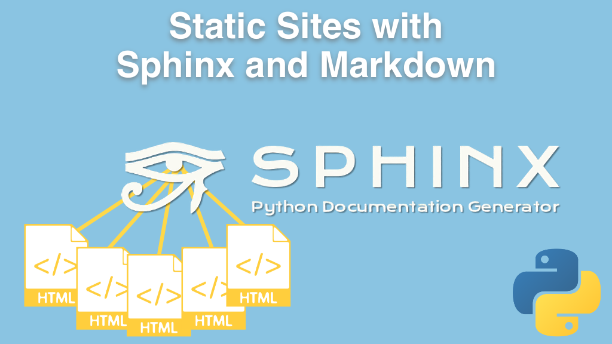

# Static Sites with Sphinx and Markdown course

Welcome to the course repository for Static Sites with Sphinx and Markdown from Talk Python Training, in parternship with JetBrains.

You'll find the code and other materials from the course. If you aren't yet registered, learn about the course and sign up at [Talk Python Training](https://training.talkpython.fm/courses/static-sites-with-sphinx-and-markdown).

